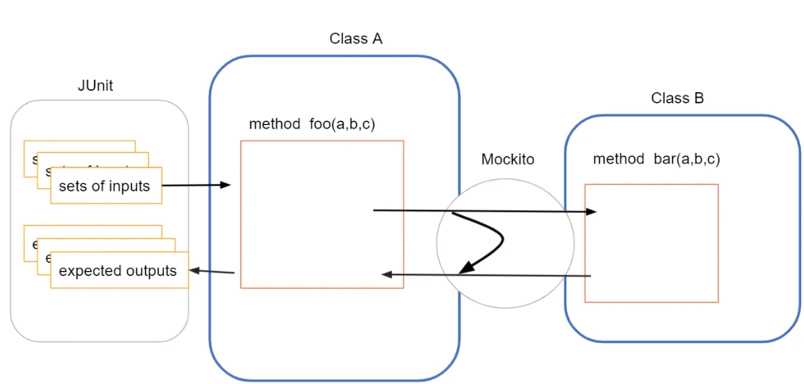

### 악취 : 냄새의 메타포
#### 리팩터링 '사전' 작성 (악취 -> 기법 -> 절차)

`더러운 코드`, `리팩터링이 필요한 코드`

#### 악취의 종류들

- 기이한 이름
  - 이름은 각각 변수 함수 모듈이 무엇을 하는지 잘 드러내야 해요.
  - 이름이 마땅히 떠오르지 않는다면, 설계에 어떤 문제가 있을 가능성이 있어요.

- 중복 코드

- 긴 함수
  - 이름에 의도를 담은 여러 함수들로 쪼개야 해요.
  - 저자의 함수영 언어 백그라운드 -> 다층의 함수를 추구해요.

- 긴 매개변수 목록
  - 매개변수가 너무나도 많다면, 그것은 악취의 종류 중 하나일 수 있어요.

- 전역 데이터
- 가변 데이터
  - 최근 언어들에서는 기본적으로 const 사용해요.
  - 추가적으로, eslint 등으로 사용 강제하는 것도 가능해요. 
  - 그러나 Reference 변수들은 여전히 문제가 있다는 것이에요.

- 뒤엉킨 변경
  - 지원해야할 DB가 추가될 때마다 함수 세 개를 바꿔야하고, 금융 상품이 추가될 때마다 또다른 함수 네 개를 바꿔야하는 모듈이 있다면?
    - 한 코드 안에 여럿이 섞여 들어가니 이것도 악취나는 코드라 말할 수 있어요.

- 산탄총 수술
  - 코드를 변경할 때마다 자잘하게 수정해야 할 때
    - 여러 코드에 흩뿌려지기 때문에 나중에 리팩터링 작업이 힘들어져요.

- 기능 편애
  - 나보다 다른 모듈과의 상호작용이 더 많을 때

- 데이터 뭉치
  - 몰려 다니는 데이터는 뭉쳐야 한다는 점이에요.
  - 언제일까요? 
    - 값 하나를 삭제해봤을 때 의미가 없어질 때입니다.

- 기본형 집착
  - Object 화 하면 좋을 것을 굳이 기본형으로 쓰는 것은 추천하지 않아요.

- 성의 없는 요소
  - 코드 한 두줄과 다를 바 없는 함수 or 메서드가 하나뿐인 클래스를 의미해요.

- 메시지 체인
  - 꼬리에 꼬리를 무는 getter 

```java
employee.manager.getId();

employee.getManagerId();
```

- 아래의 방식이 문제일 때 
  - 클래스가 `중개자`로 전락한다면, 다시 말해 getManagerXX()가 Employee 구현의 대다수를 차지했을 때 문제가 생겨요.

- 위의 방식이 문제일 때
  - 클래스가 위임과 결합도가 너무 높다면 문제가 생길 수 있어요. 
    - 만약 Manager의 구조가 바뀐다면, 사용하고 있는 manager 부분을 모두 수정해줘야 할 수도 있어요. getId() 까지 뽑는 데에 다른 메서드들이 추가된다던지.

- 서로 다른 인터페이스의 대안 클래스들
  - 두 비슷한 클래스가 서로 다른 인터페이스를 구현할 때
    - 둘의 하는 일은 비슷하지만, 인터페이스를 이용하여 서로 상호관계가 되질 못한다. 때문에 하나의 비슷한 용도라면 하나의 인터페이스로 묶는 것도 방법이다.

- 데이터 클래스
  - getter, setter만 존재하는 클래스 (예를 들어, C의 struct / Kotlin의 data class)
  - 왜 문제일까?
    - 다른 클래스가 너무 깊이까지 함부로 다룰 때가 많다는 것이에요.
    - 필요한 동작이 엉뚱한 데에 정의돼 있다는 신호일 수 있어요.

- 상속 포기
  - Super Class의 public 요소를 사용할 것이 아니라면, 상속하지 않는 게 나아요.

- 주석
  - 주석은 향기를 뿜지만, 향수를 탈취제로 사용하면 안 돼요.
### 어디까지 리팩터링 해야 할까? (부제 : 리팩터링에서 테스트의 중요성)

리팩터링의 핵심은 `겉보기 동작의 유지` 예요.

> 코드가 깨졌다면 그것은 리팩터링이 아니라 어설픈 리스터럭쳐링이다.
 
그것을 보장해주는 것이 바로 `테스트`예요.



우리는 Class A 를 Unit Test 하고 싶으나, 로직에는 그림과 같이 Class B 와 의존 관계를 맺어요. 

그런데, Test 하고자 Class B 까지 넘어가는 것은 Unit Test 의 범위를 넘어서게 돼요. 의도를 벗어난 상황인 것이지요.
그럴 때 Mock 객체를 이용해서 사용할 수 있어요.

이렇게 된다면 다른 클래스와의 의존관계가 있어도 무시하고, 해당 클래스의 단위 테스트(Unit Test)를 진행할 수 있게 되는 것이에요.

당연하지만, Class B 테스트도 A와 마찬가지로 진행하면 되는 일이에요.

Amazon에서는 (팀마다 다를 수 있음) Coverlay 라는 것을 이용해서 해당 코드의 테스트가 되었는지 확인해요. 색깔 별로 구분이 되어 있어서 
확인하기 쉬운 편이에요. 예를 들어, 주황은 일부 테스트만 되었음을 의미, 초록은 테스트 완료를, 빨강은 테스트가 전혀 되지 않았음을 의미해요.
